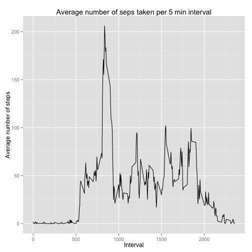
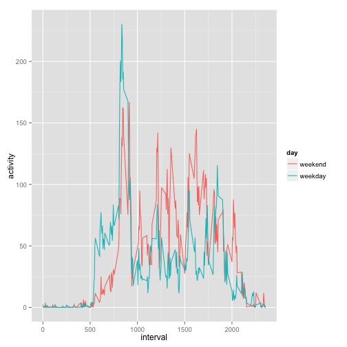
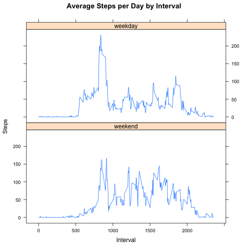

# Reproducible research project-1 (Analysing activity tracker data)

  This assignment makes use of data from a personal activity monitoring device. This device collects data at 5 minute intervals through out the day. The data consists of two months of data from an anonymous individual collected during the months of October and November, 2012 and include the number of steps taken in 5 minute intervals each day.
  
###Data description

The data for this assignment can be downloaded from the course web site: [Activity monitoring data](https://d396qusza40orc.cloudfront.net/repdata%2Fdata%2Factivity.zip) [52K]

The variables included in this dataset are:

* steps: Number of steps taking in a 5-minute interval (missing values are coded as NA)

* date: The date on which the measurement was taken in YYYY-MM-DD format

* interval: Identifier for the 5-minute interval in which measurement was taken

The dataset is stored in a comma-separated-value (CSV) file and there are a total of 17,568 observations in this dataset.


### Loading and preprocessing the data

Loading the mentioned dataset into a dataframe df


```r
if(!file.exists("getdata-projectfiles-UCI HAR Dataset.zip")) {
        temp <- tempfile()
        download.file("http://d396qusza40orc.cloudfront.net/repdata%2Fdata%2Factivity.zip",temp)
        unzip(temp)
        unlink(temp)
}

df <- read.csv("activity.csv")
```

###What is the total number of steps taken per day?


```r
steps.per.day <- tapply(df$steps, df$date, FUN=sum, na.rm=FALSE)
hist(steps.per.day, main ="Hitogram of total steps taken per day", breaks=15)
```

 

```r
mean.steps <-mean(steps.per.day, na.rm=TRUE)
median.steps <-median(steps.per.day, na.rm=TRUE)
```

* The mean of total number of steps taken per day 10766.19
* The median of total number of steps taken per day 10765

###What is the average daily activity pattern?


```r
library(ggplot2)
daily.activity.pattern <-aggregate(df$steps,by=list(df$interval), mean, na.rm=TRUE)
colnames(daily.activity.pattern)=c("interval","avgsteps")
ggplot(daily.activity.pattern, aes(interval, avgsteps)) + geom_line() +ggtitle("Average number of seps taken per 5 min interval") + xlab("Interval") + ylab("Average number of steps")
```

 

```r
max.interval <- daily.activity.pattern$interval[which.max(daily.activity.pattern$avgsteps)]
```

The average maximum activity occurs at the interval: 835

###Imputing the missing values


```r
df.trans <- df
tot.missing.values <- sum(is.na(df.trans$steps))
```

1. The total number of missing values in the dataset is 2304
2. The missing values are imputed by the average of each interval, since only a simple imputation technique was required for the assignment.


```r
imp <- transform(df.trans, steps= ifelse(is.na(df.trans$steps), daily.activity.pattern$avgsteps[match(df.trans$interval,daily.activity.pattern$interval)]  ,df.trans$steps ) )
imp.agg.date <-aggregate(imp$steps,by=list(imp$date), sum)
hist(imp.agg.date$x, main ="Histogram of total steps taken per day", breaks=15)
```

 

```r
imp.mean <- mean(imp.agg.date$x)
imp.median <- median(imp.agg.date$x)
```
3. The mean and median values
* The mean of total number of steps taken per day(after imputation) : 10766.19

* The median of the total number of steps taken per day(after imputation) : 10766.19
* The difference between original and the imputed mean values are : 0
* The difference between original and the imputed median values are : -1.188679


###Are there differences in activity patterns between weekdays and weekends?


```r
imp$weekday <- sapply(imp$date, function(x) weekdays(as.Date(x, format ="%Y-%m-%d")))
imp$rec <- NA
flag <- sapply(imp$weekday, function(x) is.element(x, c("Monday","Tuesday","Wednesday","Thursday","Friday")))
imp$rec[flag]<- 1
imp$rec[!flag]<- 0
imp$day.fac <- factor(imp$rec, labels=c("weekend","weekday"))
imp.activity.pattern <-aggregate(imp$steps,by=list(imp$interval, imp$day.fac), mean, na.rm=TRUE)
colnames(imp.activity.pattern)<- c("interval","day","activity")
ggplot(imp.activity.pattern, aes(interval, activity, group =day, colour=day)) + geom_line()
```

 


### Panel plot interpretation of the same information:


```r
library(lattice)

xyplot(imp.activity.pattern$activity ~ imp.activity.pattern$interval |imp.activity.pattern$day, main="Average Steps per Day by Interval",xlab="Interval", ylab="Steps",layout=c(1,2), type="l")
```

 
